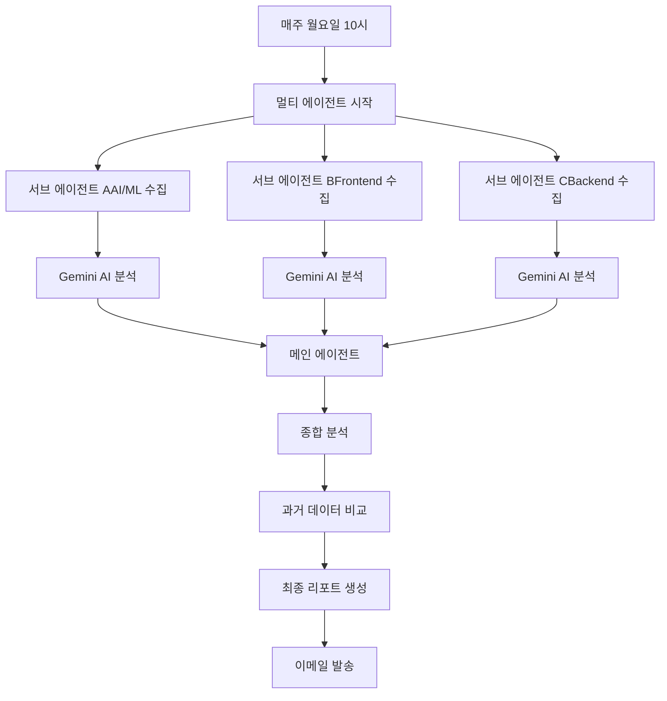

# 🚀 WebDev & AI Trends Multi-Agent System

**4개의 AI 에이전트가 협력하여 매주 최신 웹개발과 AI 트렌드를 수집, 분석, 전달하는 완전 자동화 시스템**

[](https://python.org)
[](LICENSE)
[](https://ai.google.dev)

## 🎯 핵심 기능

### 🤖 멀티 에이전트 시스템
- **4개의 전문 AI 에이전트**가 병렬로 작동
  - 👑 메인 에이전트: 종합 분석 및 최종 리포트
  - 🤖 서브 에이전트 A: AI/ML 전문
  - 🎨 서브 에이전트 B: Frontend/CSS 전문
  - ⚙️ 서브 에이전트 C: Backend/DevOps 전문

### 📊 데이터 수집원
- **Reddit**: 개발 커뮤니티 인기 포스트
- **Hacker News**: 기술 뉴스 및 토론
- **GitHub**: 트렌딩 저장소
- **X (Twitter)**: Embed API로 트윗 수집
- **RSS**: 주요 개발 블로그
- **Product Hunt**: 신규 개발 도구

### 🧠 AI 분석 기능
- **트렌드 분석**: 주요 패턴 인식
- **감정 분석**: 커뮤니티 반응 파악
- **미래 예측**: 3-6개월 트렌드 예측
- **개인화 추천**: 맞춤형 학습 제안
- **한국어 요약**: 자동 번역 및 요약

### 💰 완전 무료 운영
- Gemini API: 일 1,500회 × 4 = 6,000회
- Claude: $5 크레딧 (백업용)
- Hugging Face: 무제한 (폴백용)
- 월 운영비: **$0**

## 🛠️ 설치 방법

### 1. 저장소 클론
```bash
git clone https://github.com/your-username/webdev-ai-trends-agent.git
cd webdev-ai-trends-agent
```

### 2. 초기 설정
#### Mac/Linux:
```bash
chmod +x setup.sh
./setup.sh
```

#### Windows:
```cmd
setup.bat
```

### 3. 환경변수 설정
`.env` 파일을 생성하고 다음 정보 입력:

```env
# 메인 에이전트 (필수)
MAIN_AGENT_EMAIL=main.agent@gmail.com
MAIN_AGENT_PASSWORD=your_16_char_app_password
MAIN_AGENT_GEMINI_KEY=your_gemini_api_key

# 서브 에이전트 A (AI/ML 전문)
AGENT_A_EMAIL=agent.a@gmail.com
AGENT_A_PASSWORD=your_app_password
AGENT_A_GEMINI_KEY=your_gemini_api_key

# 서브 에이전트 B (Frontend 전문)
AGENT_B_EMAIL=agent.b@gmail.com
AGENT_B_PASSWORD=your_app_password
AGENT_B_GEMINI_KEY=your_gemini_api_key

# 서브 에이전트 C (Backend 전문)
AGENT_C_EMAIL=agent.c@gmail.com
AGENT_C_PASSWORD=your_app_password
AGENT_C_GEMINI_KEY=your_gemini_api_key

# 최종 수신자
RECEIVER_EMAIL=your_personal@gmail.com

# Reddit API
REDDIT_CLIENT_ID=your_reddit_client_id
REDDIT_CLIENT_SECRET=your_reddit_client_secret
```

### 4. API 키 발급

#### Gmail 앱 비밀번호 (필수)
1. [Google 계정 설정](https://myaccount.google.com) → 보안
2. 2단계 인증 활성화
3. 앱 비밀번호 생성 (16자리)
4. `.env`에 입력

#### Gemini API (필수, 무료)
1. [Google AI Studio](https://makersuite.google.com/app/apikey) 접속
2. "Create API Key" 클릭
3. 생성된 키를 `.env`에 입력
4. 각 에이전트마다 별도 키 생성 (총 4개)

#### Reddit API (필수)
1. [Reddit Apps](https://www.reddit.com/prefs/apps) 접속
2. "Create App" → Type: "script" 선택
3. Redirect URI: `http://localhost:8080`
4. Client ID와 Secret을 `.env`에 입력

### 5. 테스트
```bash
# 전체 시스템 테스트
python tests/test_all.py

# 개별 테스트
python tests/test_gmail.py
python tests/test_reddit.py
python tests/test_gemini.py
```

## 🚀 실행 방법

### 대화형 모드 (추천)
```bash
python run.py
```

### 즉시 실행
```bash
python run.py
# 또는
python scrapper/main.py --collect
```

### 스케줄러 시작 (매주 월요일 10시)
```bash
python scrapper/main.py --schedule
```

### 테스트 모드 (이메일 없이)
```bash
python scrapper/main.py --test
```

### 단일 에이전트 모드 (서브 에이전트 없이)
```bash
python scrapper/main.py --single-agent
```

## 📋 프로젝트 구조

```
webdev-ai-trends-agent/
├── scrapper/
│   ├── main.py                     # 메인 실행
│   ├── collectors.py                # 데이터 수집
│   ├── x_embed_collector.py        # X Embed API
│   ├── ai_agent_advanced.py        # AI 분석
│   ├── ai_quota_manager.py         # 한도 관리
│   ├── multi_agent_system.py       # 멀티 에이전트
│   ├── email_reporter.py           # 이메일 전송
│   └── schedulers.py               # 스케줄링
├── configs/
│   ├── config.py                   # 기본 설정
│   └── multi_agent_config.py       # 멀티 에이전트 설정
├── tests/
│   ├── test_gmail.py              # Gmail 테스트
│   ├── test_reddit.py             # Reddit 테스트
│   └── test_all.py                # 전체 테스트
├── outputs/                       # 생성된 리포트
├── .env                          # 환경변수 (직접 생성)
├── requirements.txt              # 필요 패키지
├── run.py                       # 실행 스크립트
├── setup.sh                     # Mac/Linux 설정
├── setup.bat                    # Windows 설정
└── README.md                    # 이 파일
```

## 🎨 작동 방식



## 📧 리포트 예시

매주 받게 되는 이메일:

```
🚀 주간 웹개발 & AI 트렌드 리포트
━━━━━━━━━━━━━━━━━━━━━━━━━━━━

🤖 AI 종합 분석 (by 4 Agents)
• 참여 에이전트: 4개
• 수집 아이템: 523개
• 중복 제거 후: 387개

🔥 이번 주 TOP 5 트렌드
1. React 19 베타 - 서버 컴포넌트 혁명
2. CSS :has() 선택자 전체 브라우저 지원
3. Cursor AI 에디터 인기 급상승
4. Tailwind v4 알파 출시
5. Gemini 1.5 Flash 성능 개선

📈 트렌드 진화
• AI 코딩 도구: 📈 급성장 (주 47% 증가)
• CSS Container Queries: 📊 안정적
• Web3: 📉 하락 중

💡 맞춤 추천
• React 개발자: Server Actions 학습 필수
• CSS 전문가: :has() 실전 활용법 익히기
• AI 관심자: Cursor/GitHub Copilot 비교

🔮 3개월 후 예측
• AI 페어 프로그래밍이 표준화
• CSS Nesting 모든 브라우저 지원
• TypeScript 5.5가 게임체인저
```

## 🔧 고급 설정

### API 한도 모니터링
```bash
python scrapper/main.py --check-quota
```

### 크론탭 설정 (Linux/Mac)
```bash
crontab -e
# 추가:
0 10 * * 1 /path/to/python /path/to/project/scrapper/main.py --collect
```

### 커스터마이징
`configs/config.py`에서 수정:
- RSS 피드 추가/제거
- 서브레딧 변경
- 필터 키워드 조정
- 스케줄 시간 변경

## 🐛 문제 해결

### Gmail 인증 실패
- 2단계 인증 활성화 확인
- 앱 비밀번호 (16자리) 사용
- 일반 비밀번호 사용 금지

### Reddit API 오류
- App type이 'script'인지 확인
- Redirect URI: `http://localhost:8080`

### Gemini 한도 초과
- 일일 1,500회 제한
- 자동으로 Claude/HuggingFace로 폴백

## 📊 성능

- **수집 시간**: ~5분 (병렬 처리)
- **분석 시간**: ~2분
- **총 처리 시간**: ~7분
- **메모리 사용**: ~500MB
- **API 사용량**: 일 평균 200회

## 🤝 기여하기

1. Fork 하기
2. Feature 브랜치 생성 (`git checkout -b feature/AmazingFeature`)
3. 커밋 (`git commit -m 'Add some AmazingFeature'`)
4. Push (`git push origin feature/AmazingFeature`)
5. Pull Request 생성

## 📝 라이선스

MIT License - 자유롭게 사용하세요!

## 🙏 감사의 말

- Google Gemini API 제공
- Reddit API 제공
- 오픈소스 커뮤니티

## 📞 지원

- Issues: 버그 리포트
- Discussions: 아이디어 공유
- Email: your-email@gmail.com

---

**Made with ❤️ by AI & Web Development Enthusiasts**